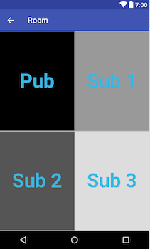

# OpenTok Multiparty app in Kotlin

This is a simple multiparty App using [OpenTok Android SDK](https://tokbox.com/developer/sdks/android/) and developed using [Kotlin 1.1.2](https://kotlinlang.org)

It uses the same rooms than [Opentok demo](https://opentokdemo.tokbox.com)

In order to keep the app simple, it limit the number of Subscribers to 3 and they will be displayed in a fixed layout:

